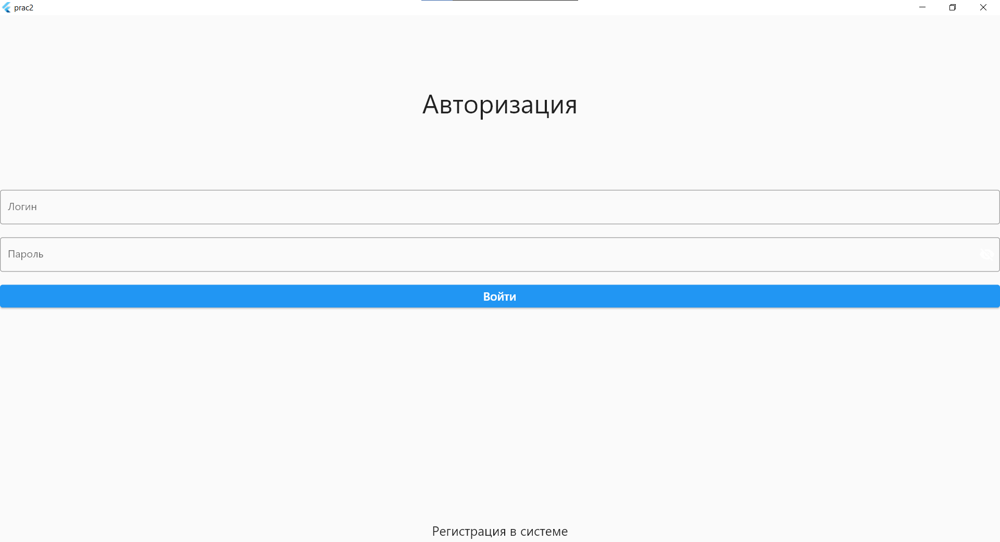
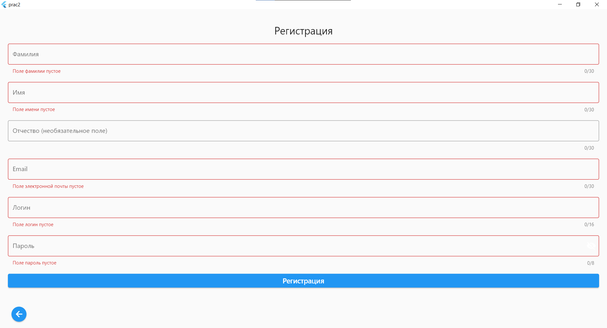
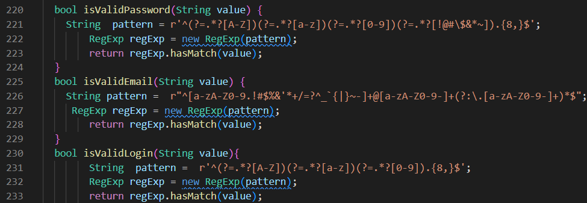
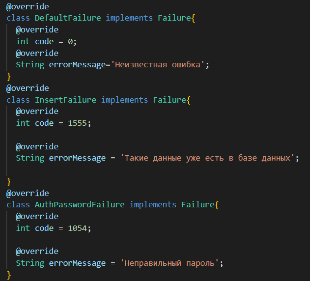
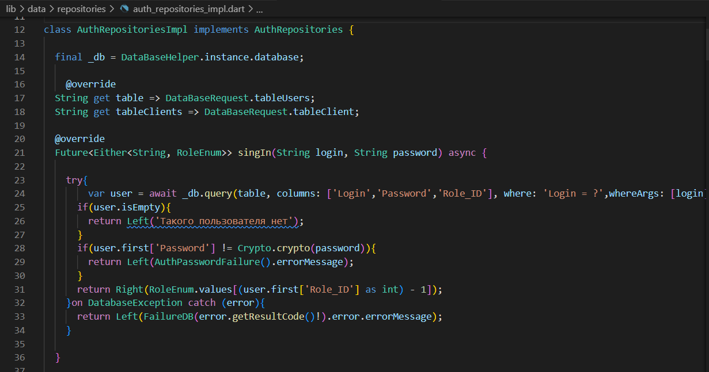
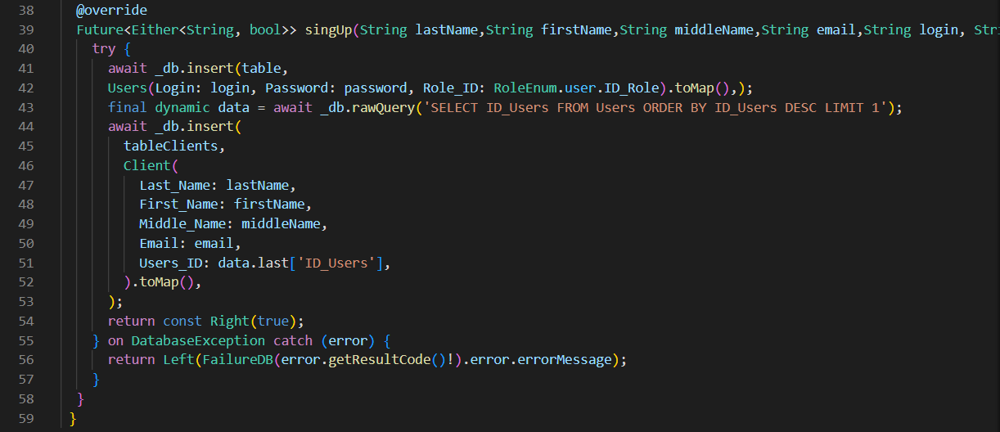
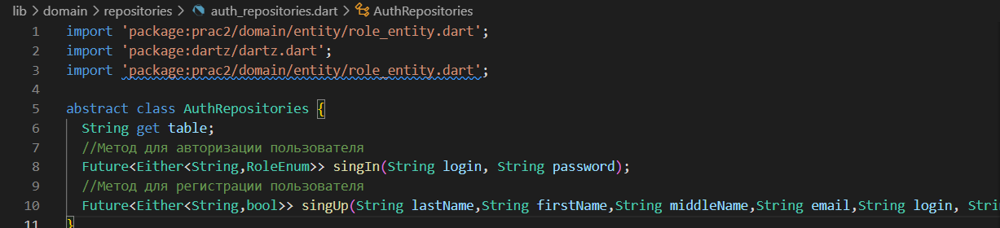
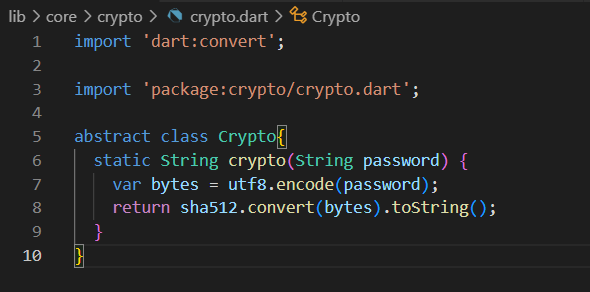
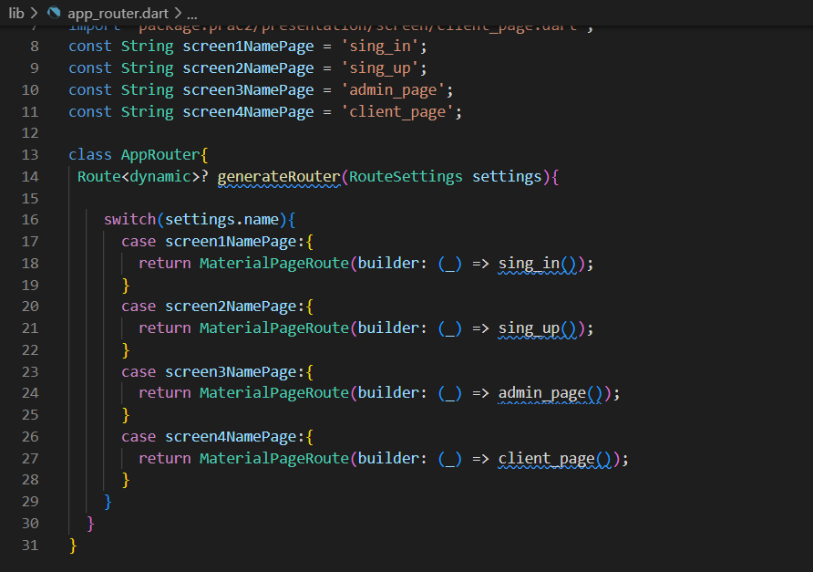
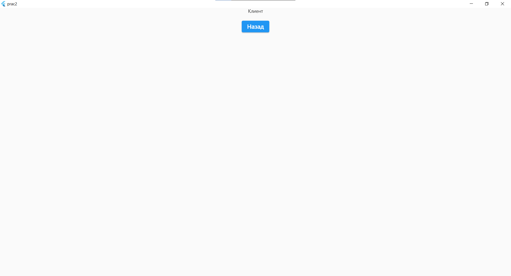

# ПРАКТИЧЕСКАЯ РАБОТА №3
## Реализация регистрации и авторизации.
Цель работы: Реализовать регистрацию и авторизацию пользователя.
Каждое поле на экране регистрации провалидировать минимум 3 критериями максимум 5.
После успешной авторизации перейти на экран в зависимости от роли пользователя.
Если авторизация или регистрация не удалась нужно вывести сообщение при помощи Snack Bar.

--------------------------------

Ход работы:

Во-первых, следует составить верстку экранов авторизации и регистрации.

Рисунок 1 - Страница Авторизации

 

Рисунок 2 - Cтраница Регистрации

Для регистрации нужно сделать валидацию данных. Это можно реализовать с помощью регулярных выражений.

   

Рисунок 3 - Регулярные выражения

Ошибки могут быть и со стороны БД, по этому прописываем файл failure.dart
    

Рисунок 4 - Файл failure.dart

Вся логика авторизации и регистрации прописана в файлах auth_repositories_impl.dart и auth_repositories.dart. Для более надежного хранения данных пароль хешируется в файле crypto.dart

Рисунок 5 - Файл auth_repositories_impl.dart

Рисунок 6 - Файл auth_repositories.dart

Рисунок 7 - Файл crypto.dart

После успешной авторизации пользователя переходит на нужную страницу под нужной ролью. Навигация между страницами прописана в app_router.dart.

Рисунок 7 - Файл app_router.dart

Рисунок 7 - Пример перехода на страницу клиента

--------------------------------

Вывод: в ходе выполнения данной практической работы удалось реализовать регистрацию и авторизацию пользователя.
