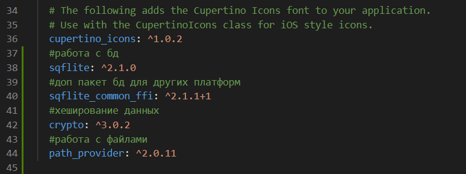
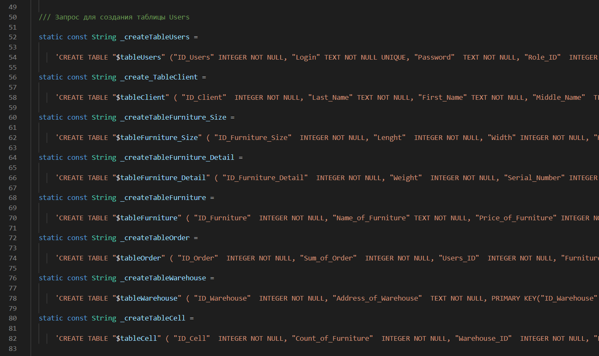
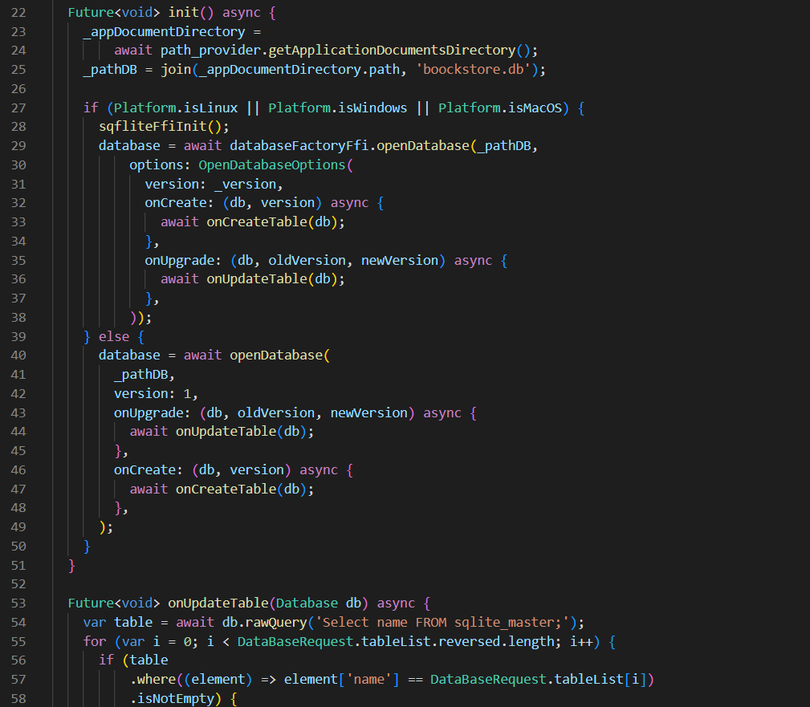
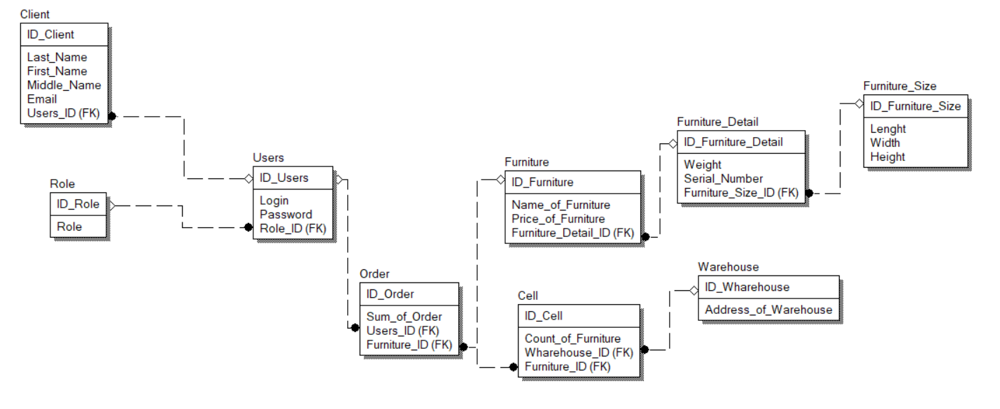
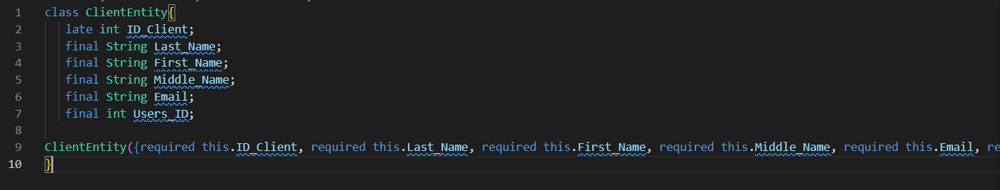
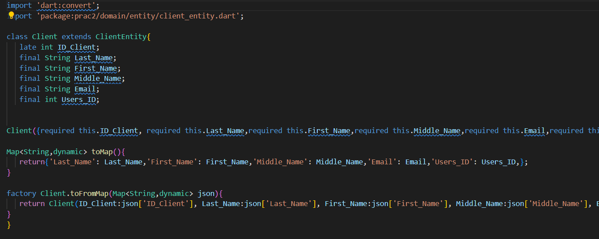

# ПРАКТИЧЕСКАЯ РАБОТА №2
## Работа с SQLite во Flutter.
Цель работы: изучить лекционный материал и выполнить практическую работу №2, в которой необходимо разработать базу данных для магазина мебели.

--------------------------------

Ход работы:

Во-первых, следует для работы с БД прописать подключения следующих библиотек в файле pubspec.yaml:

Рисунок 1 - Подключенные библиотеки для работы с БД

Во-вторых, нужно создать 2 файла: data_base_request.dart и data_base_helper.dart. В data_base_request.dart прописаны все запросы для создания таблиц, а в data_base_helper.dart, где прописаны функции для взаимодействия с базой данных.

 

Рисунок 2 - Файл data_base_request.dart

  

Рисунок 3 - Файл data_base_helper.dart

Далее необходимо разработать базу данных мебельного магазина.

 Она состоит из 9 таблиц, представленных на модели ниже:

   
Рисунок 4 - База данных мебельного магазина

Реализация в Flutter: сущности и модели.
    

Рисунок 5 - Файл client_entity.dart

Рисунок 6 - Файл client.dart

Далее все таблицы, описанные в модели, делаются подобным образом.

Рисунок 7 - Созданный файл базы данных

--------------------------------

Вывод: в ходе выполнения данной практической работы удалось изучить лекционный материал и выполнить практическую работу №2, в которой необходимо разработать базу данных для магазина мебели.
