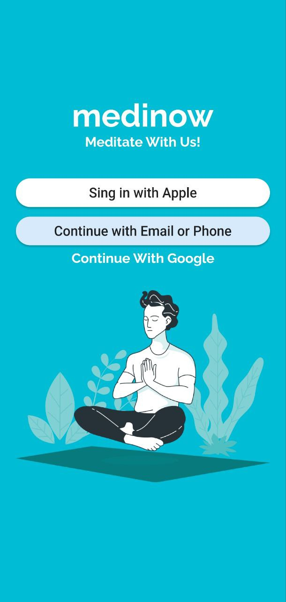
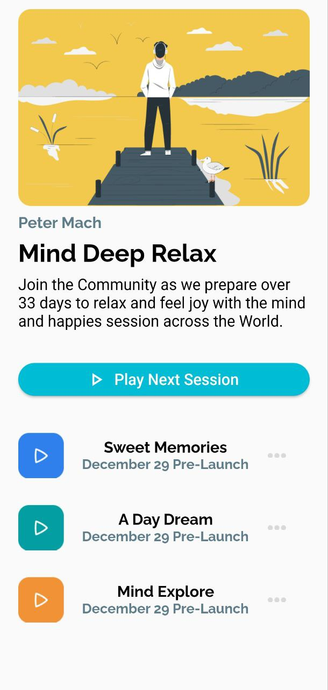
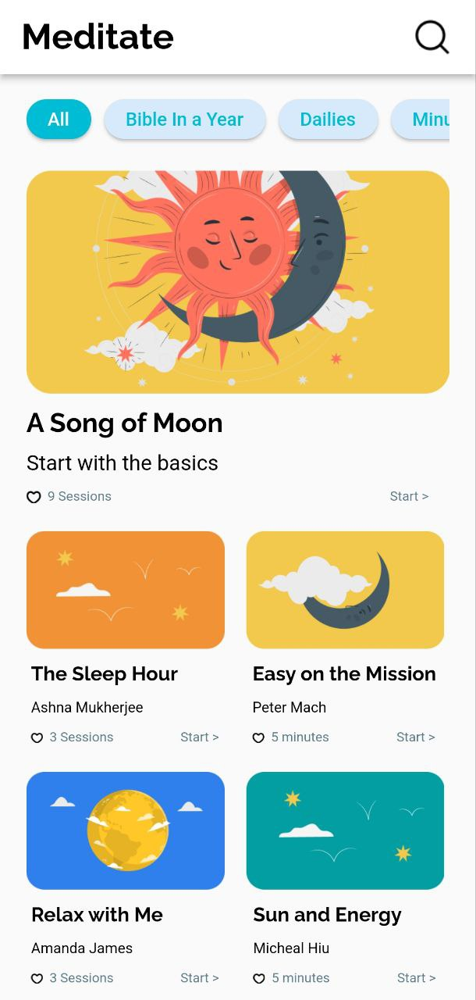

# ПРАКТИЧЕСКАЯ РАБОТА №1
## Работа с виджетами во Flutter
------------------
Цель работы: изучить лекционный материал и выполнить практическую работу №1, в которой необходимо сделать верстку трех экранов.
Ход работы:
 

При создании первого экрана была использована следующая структура виджетов:
Сначала используется Scaffold для того чтобы в нем можно было разместить остальные виджеты. У Scaffold был указан цвет фона, при помощи свойства backgroundColor: Colors.cyan. Далее были заданы отступы от левого и правого краев экрана для остальных виджетов при помощи Padding(padding: EdgeInsets.fromLTRB(20.0,0.0,20.0,0). После был использован виджет Column который отображает свои дочерние виджеты в столбец. Текст «medinow» был реализован в Container, и был задан следующий стиль: TextStyle(fontSize: 40.0, color: Colors.white, fontWeight: FontWeight. bold, fontFamily: "Raleway" (Raleway – ассет, скачанныый с интернета, добавленный в папку проекта и объявленный в pabspec.yaml). Кнопки были выполнены при помощи виджета RaisedButton, в котором указан текст, стиль, закругленность краев и цвет. А картинка внизу экрана была добавлена следующим способом: Image.asset('assets/images/login.png'), но перед этим нужно скачать ее с интернета, добавить в папку проекта и объявить в pabspec.yaml.
 

При создании второго экрана были использованы все те же виджеты, только так как картинка находится вверху экрана, и некоторые модели телефонов имеют не прямоугольный экран, был использован виджет SafeArea, для избежания потерей в верстке. И еще был использован виджет Row для нижних элементов страницы, чтобы они отображались горизонтально относительно друг друга.
 

При создании третьего экрана были использованы те же виджеты что и в двух предыдущих, но также был использован appBar, в котором текст отображается слева при помощи свойства title, а лупа справа при помощи свойства actions. Также так как на странице достаточно много элементов, и для их правильного отображения на телефонах с небольшим экраном был использован виджет SingleChildScrollView, для того чтобы можно было пролистывать экран вниз. И кнопки вверху экрана реализованы так, что их можно пролистывать, для этого также использовался виджет SingleChildScrollView, но только со свойством scrollDirection: Axis.horizontal для горизонтального пролистывания.
------------------
Вывод: в ходе выполнения данной практической работы удалось изучить лекционный материал и выполнить практическую работу №1, в которой необходимо сделать верстку трех экранов.
